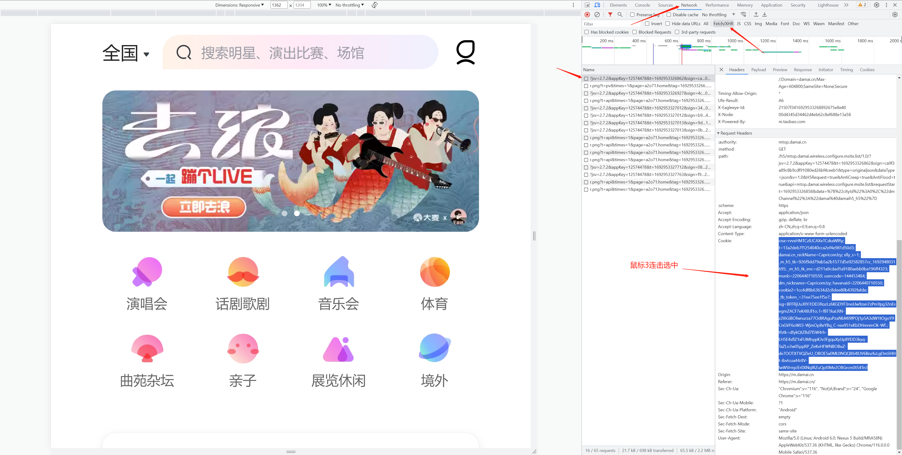

# pick-ticket-damai

大麦捡漏/aiohttp  **仅供参考，学习**

### 环境

- Python >= 3.7 (最好低于3.10)

- 依赖模块安装：```pip install -r requirements.txt -i https://mirrors.aliyun.com/pypi/simple/```
- 运行：python run.py 

### 使用
- cookie：[详见](https://github.com/lktlktlkt/ticket-damai/issues/15);
     cookie.py中实现了获取方法

- 主要配置：自用建议使用yaml进行配置

    ```python
    COOKIE = None   # 必填
  
    ITEM_ID = None  # 演唱会url中id或itemId
    CONCERT = 1   # 场次 格式 1 或者 [1, 2]
    PRICE = 1    # 价格 格式 1 或者 [1, 2], 依次对应票档。目前只有`SalableQuantity`类支持list，否则值为下标0
    TICKET = 1   # 购票数量
    
    RUN_DATE = None   # 自定义抢票时间。为兼容优先购，有特权或者演出无优先购可不配置，格式：20230619122100
    DELAY = 0   # 延迟，1=1s。大于0会在RUN_DATE加对应的时间
    
    """System"""
    # 可继承`ApiFetchPerform`，自定购票逻辑，在example.example3中有扩展
    PERFORM = 'damai.performer.ApiFetchPerform'
    ```

- 在代码中主要关注performer，example3。类中有使用注释。

### 如何获取cookie
- 在chrome浏览器登录大麦，键盘ctrl+shift+I
- 将此cookie替换ticket-damai/set_cookie/set_coolie.py中的123
- 运行ticket-damai/cookie.py，将得到一个链接，复制此链接并在和大麦同一个浏览器打开，会请求你进行滑块验证，验证成功后自动跳转到淘宝。将淘宝页面关闭。
-
### 抢票步骤
- 提前登录, 提前在大麦app中添加观演人及收货地址电话（可以在手机设置）。
- 在chrome浏览器登录大麦，进入你要抢的演唱会详情页，获取cookie
- 通过cookie获取滑块验证的URL
- 浏览器打开URL，滑块成功后，回到大麦的页面，在你要抢的演唱会详情页，刷新获取最新的cookie，这是用于抢票的cookie
- 放入config.yaml中
- 设置好config.yaml中的各项参数
- 运行run.py
